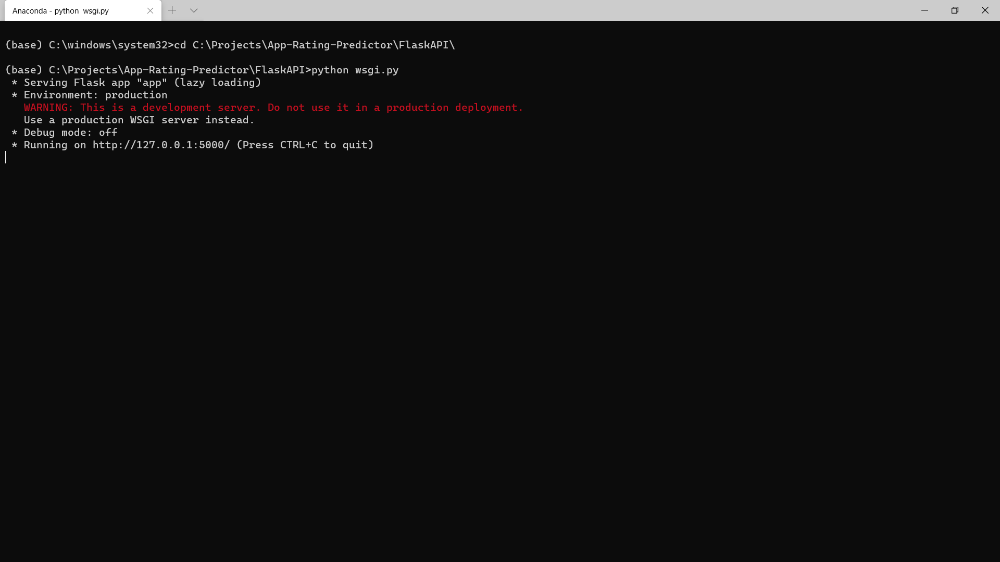
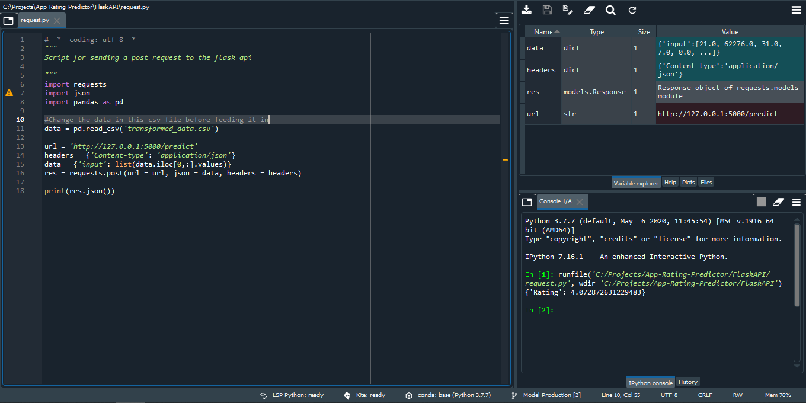
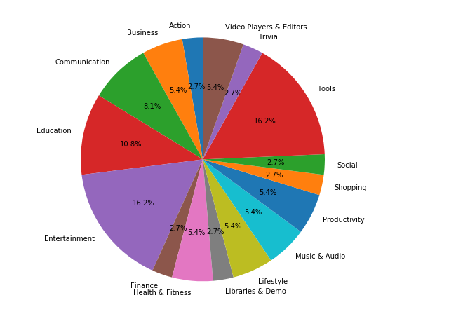
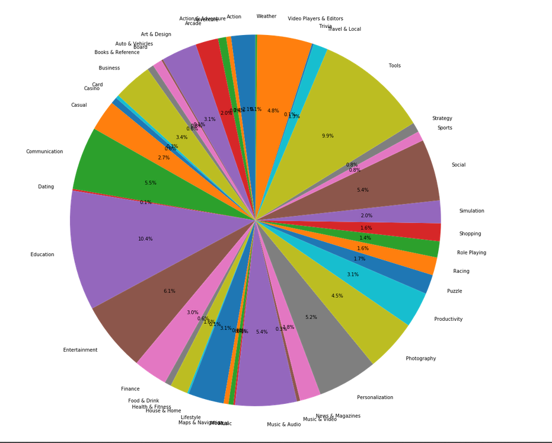

# App-Rating-Predictor

## Introduction
This Project uses data from the apps on the Google Play Store to predict the overall rating a particular app will get from its users. There are a variety of features which will be used by the model. There are approximately 850 training apps and 150 testing apps. The LightGBM model which in the code gives an error of 6.2-6.6% which is the least possible from the models that were trained on.

## Usage
This project has an API which has been made using Flask. To work with this API, first run [this](FlaskAPI/wsgi.py) Web Server Gateway Interface Script on your terminal as shown below

Now run [this](FlaskAPI/request.py) on your python editor. Before running that script make sure to change [the input data](FlaskAPI/transformed_data.csv). After running the script, you will receive an output in your console as shown:

The Scripts for creating the API can be found here : [link](FlaskAPI/)
## Web Scraper using Selenium
For getting the data from the Google Play Store this project uses a Selenium based Web Scraper Python script. The script first gets the search results for each letter of the English Alphabet and stores the URLs for each app in a list. After this it iterates through all the unique URLs and grabs the data related to every app.

The data columns which it grabs for each app are : Name, Genre, Last Update, Age Requirement, Android Version Requirement, Number of installations, Current Version, Size, Interactive elements, Company Owned by, The Name of the Developer, Number of Reviews and the Overall Rating of the app. 
The links for the script for the scraper and the scraped dataset can be found below:

Link for the Python Web Scraper - [Web Scraper](Scraper/play_store_scraper.py) 

Link for the dataset obtained after Web Scraping - [Data from Web Scraper](Data-Cleaning/play_store_data.csv)

## Cleaning the Data
Many of the columns in the data which has been scraped is not in the ideal form for performing some Exploratory Data Analysis. For example, the In-app Purchases feature has textual data like '$5 - $25 per item'. This form of data cannot be understood by a machine and we need to get it to a format where it will understand what is going on. For this purpose, Data Cleaning is done. The script to clean the data for this dataset and the cleaned dataset can be found in the link below:

Link for the Data Cleaner in Python - [Data Cleaner in Python](Data-Cleaning/cleaner.py)

Link to the Cleaned Dataset - [Cleaned Data](Cleaned_data.csv)

## EDA
Exploratory Data Analysis for this dataset didn't yield a large number of insights as such. One thing which I could see was that almost all columns had a very low correlation with the rating except for a few.

Following is the distribution of the Genre of Apps in the 0-2, 2-3, 3-4 and 4-5 rating intervals:

#### 0-2

#### 2-3

#### 3-4

#### 4-5

## Model Building
At the Model Building stage, a lot of models were tried out and the ones that did the best on this dataset were tree based boosting models.
This makes sense since a good amount of the data was categorical in nature and the splits in the trees can be very useful in segregating the different kinds of data.
To optimize the performance of the tree based boosting models, a RandomSearchCV was introduced which selected a better set of parameters for the model.
In the end on an average LightGBM always gave the best results, even better than ensembles of these tree based boosting models.

Script for Model Building can be found here: [link](Model/Model_Building.py)

### That's All Folks!!
